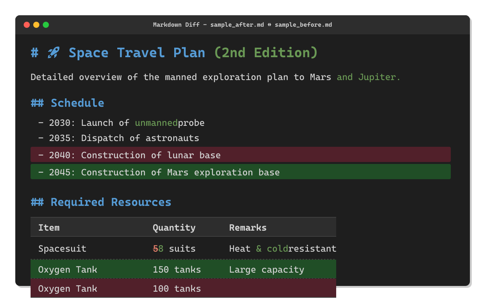

# Markdown Diff for AI

*[English](README.md)* | *[日本語](README.ja.md)* | *[中文](README.zh.md)* | *[한국어](README.ko.md)* | *[Español](README.es.md)* | *[Deutsch](README.de.md)* | *[Français](README.fr.md)* | *[Português](README.pt-br.md)*

Markdown Diff for AI es una extensión de VS Code para comparar archivos Markdown...

